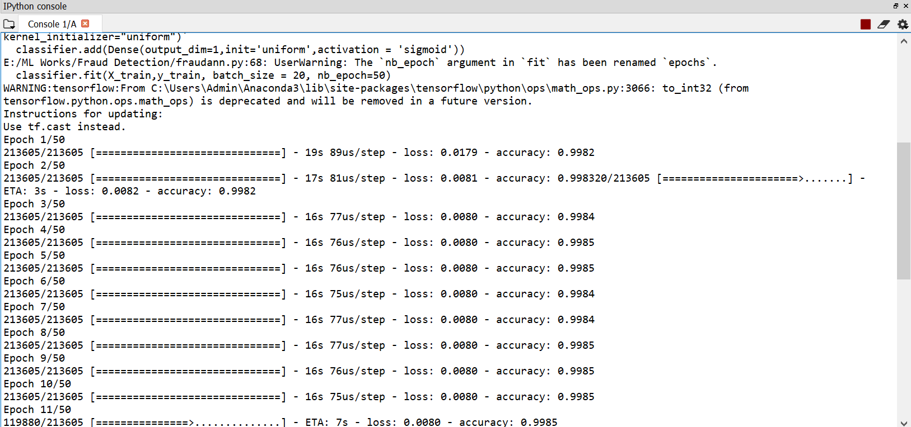
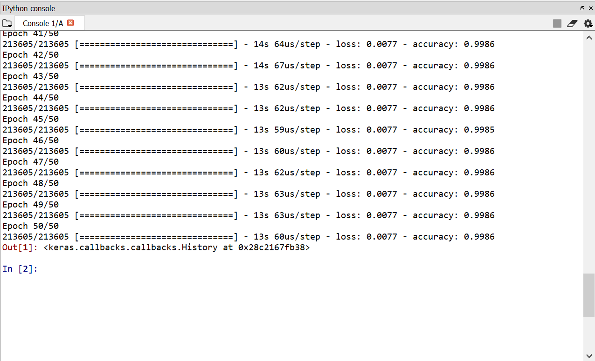

# Credit-Card-Fraud-Detection

## Code Requirements 
You can install Spider or any IDE of your choice.

## Desription
This a DL model to determine the probability of frauds on a credit card dataset.This DL model is trained with Artificial Neural Network (ANN) with 50 Epochs.Also I have done Principal Component Analysis to reduce the dimension and get a more accurate model, got an accuracy of 99.86%.

After completion of the Deep Learning project, the DL model need to deploy in an application. To deploy, the DL model need to save it first. To save the Deep Learning project we can use the pickle or joblib package.Here I have used pickle package of python to load and save the model.The pickle or joblib package saves the model to that address, later on to deploy the model we can simply load the model through the pickle file that I have included here or you can make by running the code.

## Implimentation
Run the python file 

# Licence
This project is licensed under the MIT License - see the LICENSE file for details
